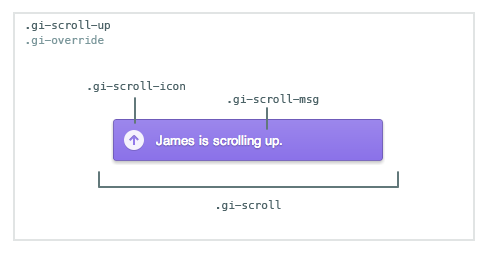

# Scroll Indicator

[Github Link](html/scroll_indicator_github.html "include")

The Scroll Indicator widget shows a notification when remote users that you're
collaborating with scroll their browser viewport, and when they're viewing a
different part of the page.

[Scroll](html/scrolling_demo_iframe.html "include")

The Scroll Indicator widget offers two separate types of scroll-related UI
indicators:

* **event** indicators that are shown while a remote user is
_actively_ scrolling.

* **position** indicators that show the relative position of the remote user's
viewport. Note that the **position** indicators are based on the viewport size and
position, not the content on the page, and may not be appropriate for pages with
a highly reactive design.

## Table of Contents

1. [Code Example](#code-example)
1. [HTML](#html)
1. [CSS](#css)
1. [Constructor](#constructor)
1. [ScrollIndicator#initialize](#scrollindicator#initialize)
1. [ScrollIndicator#destroy](#scrollindicator#destroy)
1. [ScrollIndicator#on](#scrollindicator#on)
1. [ScrollIndicator#off](#scrollindicator#off)

## Code Example

### 1. Include our CDN assets:

#### Note on Versioning

Specific version of widgets can be found on our [CDN](https://cdn.goinstant.net/).

```html
<script type="text/javascript" src="https://cdn.goinstant.net/v1/platform.min.js"></script>
<script type="text/javascript" src="https://cdn.goinstant.net/widgets/scroll-indicator/latest/scroll-indicator.min.js"></script>
<!-- CSS is optional -->
<link rel="stylesheet" href="https://cdn.goinstant.net/widgets/scroll-indicator/latest/scroll-indicator.css" />
```

### 2. Create and initialize the widget:

```js
// Connect URL
var url = 'https://goinstant.net/YOURACCOUNT/YOURAPP';

// Connect to GoInstant
goinstant.connect(url, function(err, platformObj, roomObj) {
  if (err) {
    throw err;
  }

  // Create a new instance of the widget
  var scrollIndicator = new goinstant.widgets.ScrollIndicator({ room: roomObj });

  // Initialize the indicator
  scrollIndicator.initialize(function(err) {
    if (err) {
      throw err;
    }
    // You are now seeing indicators when remote users scroll, and they
    // are seeing indicators when you scroll!
  });
});
```

## HTML

### Scroll Indicator Containers

The scroll indicators are organized into three containers; one for when the
remote user is scrolling up or looking at the page above, one for scrolling left
or viewing the page to the left, and one shared container for scrolling or viewing
down or to the right.

```html
<div class="gi-override gi-scroll-up">
   <!-- Indicators will go here for scrolling up or viewing the page above -->
   <!-- The default styling will show this div in the upper-right corner -->
</div>

<div class="gi-override gi-scroll-left">
   <!-- Indicators will go here for scrolling left or viewing the page to the left -->
   <!-- The default styling will show this div in the lower-left corner -->
</div>

<div class="gi-override gi-scroll-down-right">
   <!-- The default styling will show this div in the lower-right corner -->
   <div class="gi-override gi-scroll-right">
     <!-- Indicators will go here for scrolling right or viewing the page to the right -->
   </div>
   <div class="gi-override gi-scroll-down">
     <!-- Indicators will go here for scrolling down or viewing the page below -->
   </div>
</div>
```

### Scroll Indicator Element

Each individual indicator is placed within the appropriate container, and has the
following structure:

```html
<!-- The background-color will be the user-specific color -->
<div class="gi-scroll" style="background-color: red">
  <div class="gi-scroll-icon"></div>
  <div class="gi-scroll-msg"><!-- Indicator text goes here --></div>
  <div style="clear: both"></div>
</div>
```

The indicator text will be the user's display name, with the relevant message
describing their scrolling status. For example: "Guest is scrolling up" or
"Guest is viewing the page below".

## CSS

### Customizing the default CSS

Each class is prefixed with `gi` to avoid conflicts.  The top-level container
also has a `.gi-override` class. Our goal is to make each widget as easy as
possible to customize.

If you have not included our CSS file, you do not need to use the `gi-override`
class when styling the widget.



This stylesheet provides a good starting point for customizing the Scroll
Indicator widget:

```css
.gi-override .gi-scroll {
  /* Add custom styles for all indicators */
}

.gi-override .gi-scroll-down .gi-scroll {
  /* Add custom styles for the down direction indicators */
}

.gi-override .gi-scroll-up .gi-scroll-icon {
  /* Modify the up direction icon */
}

.gi-override .gi-scroll-msg {
  /* Add custom styles to the message container */
}

.gi-override .gi-scroll-left {
  /* Modify the left direction container */
}
```

## Constructor

Creates the `ScrollIndicator` instance.

### Methods

- ###### **new ScrollIndicator(options)**

### Parameters

| options |
|:---|
| Type: [Object](https://developer.mozilla.org/en-US/docs/Web/JavaScript/Reference/Global_Objects/Object) |
| An object with the following options: |
| - `room` is a [GoInstant Room](../javascript_api/rooms/index.html) that you have previously joined. |
| - `eventUI` [**default: true**] is a [Boolean](https://developer.mozilla.org/en-US/docs/Web/JavaScript/Reference/Global_Objects/Boolean) flag that controls the presence of the **event** indicators. |
| - `positionUI` [**default: true**] is a [Boolean](https://developer.mozilla.org/en-US/docs/Web/JavaScript/Reference/Global_Objects/Boolean) flag that controls the presence of the **position** indicators. |
| - `displayTimer` [**default: 1000**] is a [Number](https://developer.mozilla.org/en-US/docs/Web/JavaScript/Reference/Global_Objects/Number) which dictates the duration an event indicator is displayed. This value is ignored if `eventUI` is false. |
| - `threshold` [**default: 0.75**] is a [Number](https://developer.mozilla.org/en-US/docs/Web/JavaScript/Reference/Global_Objects/Number) which sets the percentage of a remote viewport that must be outside the local viewport in order to trigger a position indicator. This value is ignored if `positionUI` is false. |
| - `namespace` [**default: ''**] is a string that dictates the namespace of the key and channel on which to broadcast scroll events. This allows for multiple instances of the widget to run in the same room, without affecting one another. Namespace must follow valid [Key Name Syntax](../javascript_api/key/index.html#properties).

### Examples

With the default options, indicators will be shown for scroll events and relative scroll positions.

```js
var scrollIndicator = new ScrollIndicator({
  room: exampleRoom // Required
});
```

This widget instance will use the specified namespace as the location for key and channel data for the scroll widget.

```js
var scrollIndicator = new ScrollIndicator({
  room: exampleRoom, // Required
  namespace: 'my-namespace' // Optional
});
```

The following widget instance will only show indicators for the relative scroll positions, and only
if the remote user's viewport is entirely outside of the local user's viewport.

```js
var scrollIndicator = new ScrollIndicator({
  room: exampleRoom, // Required
  eventUI: false, // Optional
  threshold: 1 // Optional
});
```

This instance of the widget will show event indicators only, and remove them after a very short
time without any received events.

```js
var scrollIndicator = new ScrollIndicator({
  room: exampleRoom, // Required
  positionUI: false, // Optional
  displayTimer: 200 // Optional
});
```

## ScrollIndicator#initialize

Initializes the `ScrollIndicator` widget, adds the event and key bindings,
and begins populating the UI with indicator elements.

### Methods

- ###### **scrollIndicator.initialize(callback(errorObject))**

### Parameters

| callback(errorObject) |
|:---|
| Type: [Function](https://developer.mozilla.org/en-US/docs/Web/JavaScript/Reference/Global_Objects/Function) |
| The function to call when widget initialization is complete. |
| - `errorObject` will be `null` unless an error has occurred. |

## ScrollIndicator#destroy

Destroys the widget instance, clears all event and key bindings and
removes the indicators from the page.

### Methods

* ###### **scrollIndicator.destroy(callback(errorObject))**

### Parameters

| callback(errorObject) |
|:---|
| Type: [Function](https://developer.mozilla.org/en-US/docs/Web/JavaScript/Reference/Global_Objects/Function) |
| The function to call after the widget has been completely destroyed. |
| - `errorObject` will be `null`, unless an error has occurred. |

## ScrollIndicator#on

Adds an event listener to the Scroll Indicator widget.

### Supported Events

* `error ( errorObj )`: Emitted if an error is received from the GoInstant server.
  * `errorObj`: The error that was received.
* `localScrollChange ( user, directions )`: Emitted when a local change occurs that would require an event indicator to be updated.
  * `user`: The user object for the local user.
  * `directions`: The directions the user is scrolling in. Contains boolean flags for each of `up`, `down`, `left`, and `right`.
* `remoteScrollChange ( user, directions )`: Emitted when a remote Scroll Indicator widget is updated.
  * `user`: The user object for the remote user.
  * `directions`: The directions the user is scrolling in. Contains boolean flags for each of `up`, `down`, `left`, and `right`.
* `localPositionChange ( user, data )`: Emitted when a local change occurs that would require a position indicator to be updated.
  * `user`: The user object for the local user.
  * `data`: The position and size data for the local viewport. All values are in pixels. Contains `position.top`, `position.bottom`, `position.left`, `position.right`, `size.height`, and `size.width` properties.
* `remotePositionChange ( user, data )`: Emitted when a remote position indicator is updated.
  * `user`: The user object for the remote user.
  * `data`: The absolute and relative position and size data for the remote viewport. All values are in pixels. Contains `position.top`, `position.bottom`, `position.left`, `position.right`, `size.height`, and `size.width` properties. Also contains boolean flags for the relative positions, indicating what parts of the page the remote user is viewing relative to the local user: `direction.up`, `direction.down`, `direction.left`, `direction.right`.

### Methods

* ###### **scrollIndicator.on(eventName, listener)**

### Parameters

| eventName |
|:---|
| Type: [String](https://developer.mozilla.org/en-US/docs/Web/JavaScript/Reference/Global_Objects/String) |
| The name of the event to add a listener for. |

| listener |
|:---|
| Type: [Function](https://developer.mozilla.org/en-US/docs/Web/JavaScript/Reference/Global_Objects/Function) |
| The listener to add. |

## ScrollIndicator#off

Removes an event listener from the Scroll Indicator widget.

### Methods

* ###### **scrollIndicator.off(eventName, listener);**

### Parameters

| eventName |
|:---|
| Type: [String](https://developer.mozilla.org/en-US/docs/Web/JavaScript/Reference/Global_Objects/String) |
| The name of the event to remove listeners for. If unsupplied, all listeners will be removed. |

| listener |
|:---|
| Type: [Function](https://developer.mozilla.org/en-US/docs/Web/JavaScript/Reference/Global_Objects/Function) |
| The listener to remove, if any. If unsupplied, all listeners will be removed for the event. |
